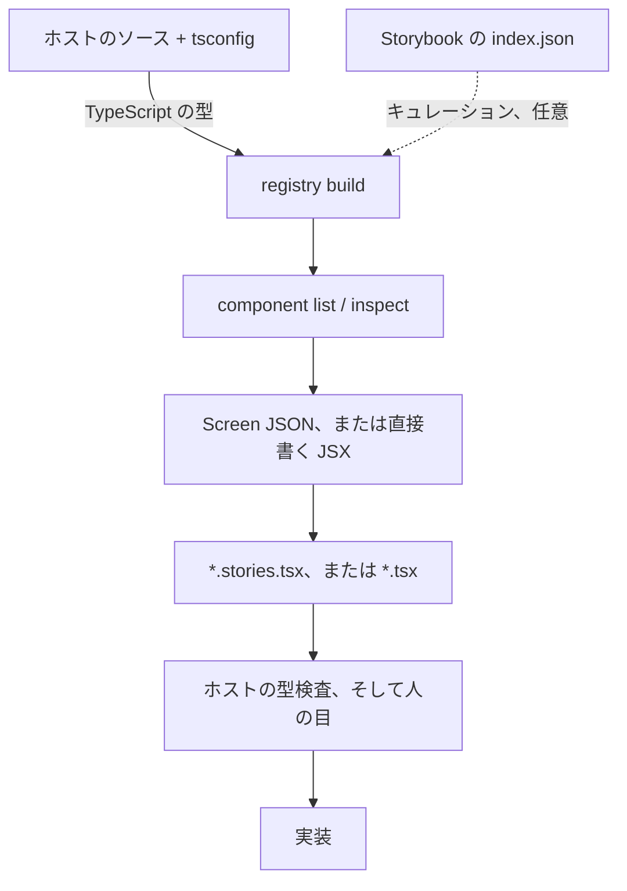

# Yosegi

[English](./README.md) | 日本語

Storybook に登録済みのコンポーネントから画面 UI を組み立て、Story として書き出し、その Story を実装へ転換します。
使い手はコーディングエージェントで、入口は CLI・MCP サーバ・Agent Skill の 3 つです。GUI はありません。

> 寄木細工（yosegi）は、小さな木片を寄せ集めて一つの模様を作る日本の木工技法です。
> デザインシステムのコンポーネントを寄せて画面を組む、というこのツールの営みになぞらえています。

React + TypeScript のプロジェクト向け。Component Registry は TypeScript の型から作られ、出力は CSF（`.stories.tsx`）。Storybook を持たないホストでは、素の React コンポーネントファイル（`screen generate --target component`）を出力できます。

## 仕組み

1. **Component Registry** — ホストのソースの TypeScript の型を読んでコンポーネントのカタログにします。props、slots、enum の選択肢、実際に書く import specifier のすべてが既定では型から決まります。
   型で表現できないわずかな穴は `--metadata` で埋め、`--index` 単独で作った Registry には型情報がありません（[`docs/ja/registry.md`](./docs/ja/registry.md)）。
2. **参照** — `component inspect` はコンポーネントの props の正となる情報源。
   フォーク先で改名された variant、children ではなく名前付き slot になっている `ReactNode` prop、export 名が衝突する 2 つのコンポーネント。
   どれも React の知識からは導けません。
   画面の骨格や合成の作法は、ここではなくホスト自身の Story やテンプレートから得ます。
3. **Story** — 成果物。
   エージェントはその事実を元に `.stories.tsx` を書きます。
   静的な画面なら、先に Screen JSON を通して機械可読な検証（自力で直せるエラー）を得てもかまいません。
4. **レビュー** — Story はホストの Storybook に置かれ、そこで目視します。
   その前にホスト自身の型検査が JSX を実物の型と突き合わせます。Yosegi は独自の描画環境を持ちません。
5. **実装** — 承認された Story を実ページにします。Yosegi が生成した Story であれば実装コンテキスト（貼れる import 文・使用 props・slot 構造・残っている結線）も出せます。



破線は任意です。Registry は型から作られます。Story のレビューは Storybook で行いますが、Storybook を持たないホストは代わりに素のコンポーネントファイルを書き出し、そのホストなりの方法でレビューします。

実運用の React デザインシステムでの実測: 120 ファイルから 278 コンポーネントを約 4 秒、98.9% は props まで型から取得、出力は決定的です。
詳細は [`docs/ja/registry.md`](./docs/ja/registry.md)。

## 使いどころ

- **画面モックを速く作る。** 画面を頼むと、エージェントがコンポーネントを調べ、Story を書き、チームが Storybook でレビューします。
  描かれるのは実物のコンポーネントで、props も実物です。
- **自社 API の当て推量をやめる。** エージェントは、上流ライブラリが受け取っていた props を書くのではなく、そのコンポーネントが何を受け取るかを Registry に訊きます。
- **ホストをコンテキストに載せない。** ベンチマーク済み: デザインシステム規模では、Registry はソースを読んだ場合と同じ画面を、どの運び手よりも少ない読解量で出します。
  ソースの 5 分の 1、パッケージ同梱の `.d.ts` の 3 分の 1（[`docs/ja/benchmark.md`](./docs/ja/benchmark.md)）。
- **Figma を介さずイテレーションする。** レビューで見るものと実装で使うものが同じになります。
  新しいビジュアル表現を決めるのは引き続き Figma の仕事です。

詳細は [`docs/ja/workflows.md`](./docs/ja/workflows.md)。

Storybook 10.3 以降は公式の MCP サーバと Component Manifest を同梱します。Yosegi がどこで重なり、どこで重ならないかは [`docs/ja/storybook-mcp.md`](./docs/ja/storybook-mcp.md) にまとめています。

## インストール

Node.js 22 以上。
パッケージマネージャは何でもかまいません。Registry は TypeScript のコンパイラ API を通して型を読みます。5.4 から 6.x までがこの API を同梱しており、TypeScript 7 は同梱しません。7 のホストは 6 と 7 を side-by-side で入れます。[TypeScript 7 のホスト](./docs/ja/registry.md#typescript-7-のホスト)を参照。

```sh
# npm
npm i -D @yosegi/yosegi
# pnpm
pnpm add -D @yosegi/yosegi
# yarn
yarn add -D @yosegi/yosegi
# bun
bun add -d @yosegi/yosegi
```

## クイックスタート

以下の `yosegi` は `npx yosegi`（`pnpm yosegi`、`yarn yosegi`、`bunx yosegi`）を指します。

```sh
# 型から Component Registry を作る
yosegi registry build \
  --source "app/components/**/*.tsx" \
  --tsconfig ./tsconfig.json \
  --data-dir .yosegi

# コンポーネントを探す
yosegi component list --query card --data-dir .yosegi
yosegi component inspect "app/components/ui/button#Button" --data-dir .yosegi

# Screen JSON から Story を生成する
yosegi screen generate tmp/screen.json \
  --out app/components/screens/customer-list.stories.tsx \
  --import-map "./app=~" \
  --data-dir .yosegi
```

引数なしで `yosegi` を実行すると全コマンドが出ます。
通しの手順: [`docs/ja/getting-started.md`](./docs/ja/getting-started.md)。

## Agent Skill

Yosegi の主な使い方はこれです。[`skills/yosegi/`](./skills/yosegi/) にワークフローがまとまっています（英語）。`SKILL.md` が手順で、`references/` に Registry の読み方・コマンドリファレンス・Screen JSON 仕様・エラー対応・実装ガイドが入っており、必要になった時点で開かれます。

```sh
npx skills add yosegi-dev/yosegi
```

または、インストール済みのパッケージからコピーします。

```sh
mkdir -p .claude/skills
cp -R node_modules/@yosegi/yosegi/skills/yosegi .claude/skills/
```

`SKILL.md` にはタイトル直下にバージョンの日付があります。
入れた Skill が最新かは、このリポジトリの同ファイルと日付を比べて確認します。
使っているエージェントツールが読む場所 1 箇所だけに入れます。
ホストリポジトリの別の場所に残った未追跡の複製は、まさにこの日付チェックが検出すべき古い複製そのものになります。

あとは「既存のコンポーネントで画面案を作って」と頼みます。

## ドキュメント

| ドキュメント | 内容 |
| --- | --- |
| [はじめに](./docs/ja/getting-started.md) | チームでのセットアップと通しの手順 |
| [ワークフロー](./docs/ja/workflows.md) | ユースケース、上流・下流のループ、エラー code |
| [Storybook MCP と Yosegi](./docs/ja/storybook-mcp.md) | 公式 Storybook MCP との重なりと棲み分け |
| [Screen JSON](./docs/ja/screen-json.md) | コンポーネント id、合成プリミティブ、bindings / events |
| [CLI リファレンス](./docs/ja/cli.md) | 全コマンドとフラグ、および MCP ツール |
| [開発](./docs/ja/development.md) | パッケージ構成、ビルド、公開前検証 |
| [ロードマップ](./docs/ja/ROADMAP.md) | 予定している作業と未決の論点 |
| [Component Registry](./docs/ja/registry.md) | 型がカタログになる仕組みと実測 |
| [ベンチマーク](./docs/ja/benchmark.md) | Registry がエージェントの出力をどう変えるかを 4 つの UI ライブラリで実測 |

このリポジトリでの作業: [`AGENTS.md`](./AGENTS.md)、[`CONTRIBUTING.md`](./CONTRIBUTING.md)（英語）、[ドキュメント規約](./docs/ja/conventions.md)。

## バージョニング

1.0 未満のあいだは、マイナーバージョンにも破壊的変更が入り得ます。

## ライセンス

[MIT](./LICENSE)
