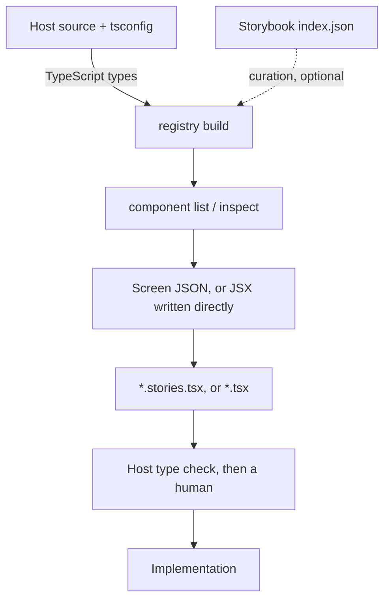

# Yosegi

English | [日本語](./README.ja.md)

Assemble screen UIs from the components already in your Storybook, emit them as Stories, and turn
those Stories into implementations. Driven by coding agents — the entry points are a CLI, an MCP
server, and an Agent Skill. No GUI.

> *Yosegi* (寄木細工) is a Japanese marquetry technique: small pieces of wood gathered into one
> pattern. The tool gathers design system components into a screen.

For React + TypeScript projects. The registry is built from TypeScript types, and the output is CSF
(`.stories.tsx`) — or, on hosts without Storybook, a plain React component file
(`screen generate --target component`).

## How it works

1. **Registry** — reads your source's TypeScript types into a component catalog. Props, slots, enum
   options, and the import specifier you actually write all come from types by default;
   `--metadata` fills the rare gaps the types cannot express, and an `--index`-only registry
   carries no types ([`docs/registry.md`](./docs/registry.md)).
2. **Lookup** — `component inspect` is the source of truth for a component's props. Your fork's
   renamed variants, a `ReactNode` prop that is a named slot rather than children, two components
   sharing one export name: none of that is derivable from knowing React. The screen's skeleton and
   composition idiom come from the host's own Stories and templates, not from here.
3. **Story** — the deliverable. The agent writes the `.stories.tsx` against those facts, or routes a
   static screen through Screen JSON first for machine-readable validation it can self-correct from.
4. **Review** — the Story drops into your Storybook, which is where you look at it, after the host's
   own type check has read the JSX against the real component types. Yosegi has no renderer.
5. **Implementation** — the approved Story becomes a real page. For a Yosegi-generated Story it also
   emits implementation context: imports to paste, props in use, slot structure, and wiring to do.



The dotted edge is optional — the registry is built from types. Reviewing a Story does happen in
Storybook; a host without one emits a plain component file instead and reviews it its own way.

Measured on a production design system: 278 components from 120 files in about 4 seconds, 98.9%
with props read from types, deterministic output. See [`docs/registry.md`](./docs/registry.md).

## What you use it for

- **Mock a screen fast.** Ask for a screen; the agent looks up the components, writes the Story, and
  your team reviews it in Storybook — drawn with the real components, with the real props.
- **Stop guessing at your own API.** The agent asks the registry what a component takes instead of
  writing what the upstream library used to take.
- **Keep the host out of the context window.** Benchmarked: the registry gets an agent to the same
  screen as reading the source, off the smallest read of any carrier — a fifth of the source, a
  third of a package's `.d.ts` at design-system scale ([`docs/benchmark.md`](./docs/benchmark.md)).
- **Iterate without Figma in the loop.** What you review and what you implement are the same
  components. Figma still owns new visual design.

Details in [`docs/workflows.md`](./docs/workflows.md).

Storybook 10.3+ ships an official MCP server and Component Manifest of its own. Yosegi complements
them rather than competing; the split is in [`docs/storybook-mcp.md`](./docs/storybook-mcp.md).

## Install

Requires Node.js 22+. Any package manager. The registry reads your types through the TypeScript 6.x
compiler API, which TypeScript 7 no longer ships — hosts on 7 install 6 and 7 side by side, see
[Hosts on TypeScript 7](./docs/registry.md#hosts-on-typescript-7).

```sh
# npm
npm i -D @yosegi/yosegi
# pnpm
pnpm add -D @yosegi/yosegi
# yarn
yarn add -D @yosegi/yosegi
# bun
bun add -d @yosegi/yosegi
```

## Quickstart

`yosegi` below means `npx yosegi` (`pnpm yosegi`, `yarn yosegi`, `bunx yosegi`).

```sh
# Build the registry from your types
yosegi registry build \
  --source "app/components/**/*.tsx" \
  --tsconfig ./tsconfig.json \
  --data-dir .yosegi

# Find components
yosegi component list --query card --data-dir .yosegi
yosegi component inspect "app/components/ui/button#Button" --data-dir .yosegi

# Generate a Story from a Screen JSON
yosegi screen generate tmp/screen.json \
  --out app/components/screens/customer-list.stories.tsx \
  --import-map "./app=~" \
  --data-dir .yosegi
```

Run `yosegi` with no arguments for every command.
Full walkthrough: [`docs/getting-started.md`](./docs/getting-started.md).

## Agent Skill

This is the primary way to use Yosegi. [`skills/yosegi/`](./skills/yosegi/) packages the workflow:
`SKILL.md` is the procedure, `references/` holds the registry guide, command reference, Screen JSON
spec, error recovery, and implementation guide — opened as needed.

```sh
npx skills add yosegi-dev/yosegi
```

Or copy it out of an installed package:

```sh
mkdir -p .claude/skills
cp -R node_modules/@yosegi/yosegi/skills/yosegi .claude/skills/
```

`SKILL.md` carries a version date under its title — compare it against this repository's copy to
confirm an installed skill is current. Install it into one location your agent tool reads; a second,
untracked copy elsewhere in the host repository is exactly the kind of stale copy that check exists
to catch.

Then: *"build me a screen proposal from the existing components"*.

## Documentation

| Document | What it covers |
| --- | --- |
| [Getting started](./docs/getting-started.md) | Team setup and the full walkthrough |
| [Workflows](./docs/workflows.md) | Use cases, upstream and downstream loops, error codes |
| [Storybook MCP and Yosegi](./docs/storybook-mcp.md) | The overlap with Storybook's official MCP, and the split |
| [Screen JSON](./docs/screen-json.md) | Component ids, synthetic primitives, bindings / events |
| [CLI reference](./docs/cli.md) | Every command and flag, plus the MCP tools |
| [Development](./docs/development.md) | Package layout, build, pre-publish verification |
| [Roadmap](./docs/ROADMAP.md) | Planned work and open questions |
| [Component Registry](./docs/registry.md) | How types become a catalog, and the measurements |
| [Benchmark](./docs/benchmark.md) | What the registry changes in an agent's output, measured across four UI libraries |

Working in this repository: [`AGENTS.md`](./AGENTS.md), [`CONTRIBUTING.md`](./CONTRIBUTING.md),
[documentation conventions](./docs/conventions.md).

## Versioning

Pre-1.0: minor versions may include breaking changes.

## License

[MIT](./LICENSE)
