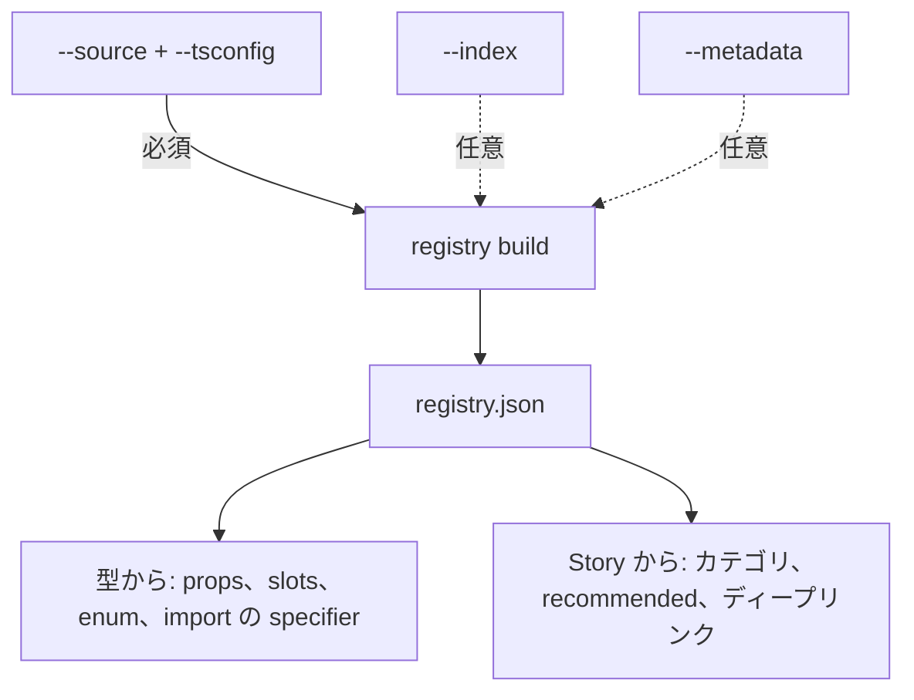

# Component Registry

[English](../registry.md) | 日本語

Component Registry はホストのソースの TypeScript の型から生成されます。
このページでは抽出の仕組み、その裏にある判断、そして実ホストでの実測を扱います。

- 実装: `packages/server/src/registry/source-registry.ts`
- CLI: `registry build --source <glob> --tsconfig <path> [--index <path|url>]`
- 計測日 2026-08-07、対象は実運用の React デザインシステム（`app/components/**`）

## 誰に効くか

Registry の効果は、ホストのコンポーネントが一般的な React 知識からどれだけ乖離しているかに比例します。
改変していないコンポーネントライブラリ、あるいはそれを薄くラップしただけのホストには効果が小さくなります。
エージェントはその API をたいてい何の助けもなく正しく推測できます。variant 名を独自に付け替え、独自の prop 語彙を発明し、状態を実行時オブジェクトでモデル化し、ドメイン固有の enum を組んだホストほど効果は大きくなります。
それらは一般的な React 知識から推測しようがないためです。

これは、まさにこの形の乖離を持たせた合成ホストで計測済みです。
結果の形はこうなります。
画面仕様だけを渡されたエージェントは API を発明して失敗します。API をソース、パッケージ同梱の `.d.ts`、Registry のどれで供給しても同じクリーンな画面になり、Registry はその 3 つのうちデザインシステム規模で最小の読解量になります。
数値、方法、限界: [ベンチマーク](./benchmark.md)。

## 3 つの情報源と役割

- **TypeScript の型がコンポーネントについての正。** props、slots、import 先はすべて型から導かれるので、ホストが Registry を手書きすることは無く、実装からずれることもありません。
  明示的な例外は、型で表現できないコンポーネントを埋める後述の `--metadata` だけです。
- **Story はキュレーションの信号と使用例。** ホストがどれを使ってほしいのか、どう組み合わせるのかを示します。
- **Storybook は描画環境。** 組んだものを見る場所。



props を型から読めることが検証を可能にしています。`variant` のような enum は取りうる値が分かるので、誤った値は選択肢付きの `INVALID_PROP_VALUE` として返り、人のレビューへ持ち越されません。Story の有無に関わらず export されているコンポーネントはすべて見え、import 先はファイルパスからの推測ではなく確定値になります。

props を型で表現できない少数のコンポーネントについては `--metadata` が手作業で穴を埋めます。[きれいに抽出できないパターン](#きれいに抽出できないパターン)を参照。

## 仕組み

型の抽出には [react-docgen-typescript](https://github.com/styleguidist/react-docgen-typescript) を使います。Storybook も同じ実装を使うように設定でき、そう設定しているホストでは、Registry の内容がホストの Storybook での見え方から乖離しにくくなります。
props を別の方法で読んでいるホストでは、両者がずれる場合もあります。`@yosegi/core` は zod のみに保つ方針なので、型抽出は `@yosegi/yosegi` に置いています。

### TypeScript 7 のホスト

TypeScript 7.0 はコンパイラ API を同梱しておらず、型抽出は 6.x の API の上に成り立っています。
そのため 7 を入れているホストは、TypeScript チームが推奨する [side-by-side の構成](https://devblogs.microsoft.com/typescript/announcing-typescript-7-0/)を取ります。`devDependencies` を 1 つではなく 2 つ入れます。

```json
{
	"devDependencies": {
		"@typescript/native": "npm:typescript@^7.0.2",
		"typescript": "npm:@typescript/typescript6@^6.0.2"
	}
}
```

`tsc` は `@typescript/native` から 7 のまま動きます。
互換パッケージは `tsc6` を追加します。`typescript` を解決するツールは、Yosegi も含めて 6.x の API を読みます。`typescript` だけをエイリアスすると `tsc` も一緒に失われます。
互換パッケージが同梱するのは `tsc6` であって `tsc` ではないためです。

これでツリー上の `typescript` は 1 つになり、Yosegi と共有されます。
エイリアスが無い場合、`registry build` は解決した version と上記のエントリを添えて失敗します。Yosegi 側にコピーが入るだけでは解決しません。
パッケージマネージャが react-docgen-typescript をホストのツリー最上位へ巻き上げるため、`@yosegi/yosegi` 配下のコピーではなくホストの 7 を見てしまいます。

bun ではこの構成が正しく解決されません。
互換パッケージは自身の `npm:typescript@^6` 依存を経由して実体の 6.x コンパイラを参照しますが、bun はこれを互換パッケージ自身へ差し戻します。
そのため `typescript` は自分自身を再 export する形になり、`registry build` は `ts.TypeFlags` が `undefined` であるところで失敗します。
互換パッケージを挟まず、6.x のコンパイラに直接依存してください。

```json
{
	"devDependencies": {
		"@typescript/native": "npm:typescript@^7.0.2",
		"typescript": "^6"
	}
}
```

`tsc` は `@typescript/native` から 7 のまま動き、型抽出は 6.x の API を読みます。
ツリーが手放すのは `tsc6` ですが、ここで呼ぶものはありません。
この形は npm と pnpm でも動きます。
この不具合は [oven-sh/bun#33835](https://github.com/oven-sh/bun/pull/33835) で上流では修正済みですが、bun 1.3.14 時点では未リリースです。

### id と import

- `id` = `<projectRoot からのモジュールパス>#<exportName>`（例: `app/components/ui/card#CardHeader`）
- `import.packageName` = Storybook の `componentPath` と同じ形（`./app/components/ui/card.tsx`）
- `import.exportName` = 実際の名前付き export
- `import.specifier` = ホストの tsconfig `paths` を解決したモジュールパス（`~/components/ui/card`）。
  コンパイルは通りますが、ホスト自身のコードが実際に書く specifier とは限りません
- `import.kind` = default export なら `"default"`。
  名前付きの場合は付きません

この `モジュールパス#exportName` 形式が Registry id の正式な形（決定事項）。1 ファイルが複数のコンポーネントを export する場合（`Card` / `CardHeader` / `CardBody`）を区別できるのはこの形だけで、名前だけでは足りません。

`--source` を伴わない `--index` 単独での生成にも対応しています。
この経路には読むべき型が無いので、id は短く（`Button`）props もありません。`--source` と併用するキュレーション用、あるいは `--metadata` の手書きを前提とした簡易用途という位置づけです。

`--project-root` は glob と id の基準で、既定は `--tsconfig` のあるディレクトリ（ホストのパッケージルート）。`app/components` を基準にすれば id は `ui/card#CardHeader` と短くなりますが、`import.packageName` の基準とずれるので既定は変えていません。

**`packageName` はパス、`specifier` は import 文**。tsconfig の `paths` で alias を張っているホストは `./app/components/ui/card.tsx` とは書きません。
だから、パスしか報告しない Registry がエージェントに渡す import 文は、解決できない 1 行になります。
そのため Registry 生成時にホストの `paths` を解いて生パスと併せて保存し、`component inspect` と `screen generate` はどちらもそちらを使います。
複数の alias が当たる場合はより深い substitution の方を採用します（`"~/*": ["./app/*"]` が総当たりの `"*": ["./*"]` に勝ちます）。
末尾の `/index` は落とし、どの alias にも当たらないファイルは相対パスのままにします。tsconfig の外（bundler の `resolve.alias` 等）で alias を張っているホストは `registry build --import-map "./app=~"` で解決ごと上書きできます。

`screen generate` の `--import-map` は後段の別の仕組みで、生成時に `packageName` を書き換え、`specifier` より優先されます。
既にこのフラグを渡しているパイプラインの出力は変わりません。

`specifier` が指すのはコンポーネントが宣言されている最も深いモジュールであって、ホストが実際に import したがる入口とは限りません。
バレル（`~/components/pagination/paginator` を re-export する `~/components/pagination`）を併設しているホストは、自前のコードの大半でバレルを書きます。
それでも `specifier` は深い方のパスを報告します。
どちらもコンパイルは通りますが、ホストの支配的な流儀に合うのは片方だけです。
実運用ホストでの計測では、同じディレクトリでバレルの import が 22 回、深い方のパスが 10 回現れ、example のテンプレートはバレルを使っていました。`specifier` は「解決済みでコンパイルが通るパス」として扱い、「ホストが好む方」だという主張だとは受け取らないでください。

### default export

default export はモジュール上の名前を持たないので、宣言側の名前を使います。`export default function ContentCard` と `export default ContentCard` はどちらも `ContentCard` になります。import の書き方は `import.kind: "default"` に残します。
これは見た目より効きます。
ページ相当の合成例は慣習的に `export default function` で書かれるので、これが無いと Registry からは丸ごと見えません。

同じ実体を named と default の両方で export しているファイルは、named の方で 1 件だけ登録します。
無名の default export（`export default () => ...`）は id にも JSX のタグ名にもできる名前が無いので載せず、`--report` に `unnamed-default` として報告します。

export 名は `displayName` ではなく TypeChecker が返すモジュールの export 名を使います。`ForwardedText.displayName = "Text"` のように実際の export 名と表示名を入れ替えるコンポーネントがあるため、`displayName` を基準にすると id が壊れます。react-docgen-typescript の `componentNameResolver` へ `(exp) => exp.getName()` を渡しています。
さらに、自前の `checker.getExportsOfModule()` から得た export 名と突き合わせています。

### props の型の変換

| 型 | Registry での扱い |
| --- | --- |
| `string` / `number` / `boolean` | 同名の kind |
| 文字列・数値リテラルの union | `enum` + `options` |
| `null` を含む union | `nullable: true`（`options` からは除く） |
| `ReactNode` / `ReactElement` | prop ではなく **slot** |
| 関数型（`=>` を含む） | `function` / `editable: false` + `signatures` |
| それ以外 | `json` / `editable: false` + `shape`（呼び出せる型なら `signatures`） |
| JSDoc | `description` |

`shouldExtractValuesFromUnion` を有効にすると、任意 prop はすべて `name: "enum"` として届きます（`string \| undefined` も union だから）。
型名からは何も分からないので、順序はこうです。
リテラルの一覧を取り出せたときだけ enum として扱い、それ以外は `raw` の型テキストから判断します。cva の `VariantProps` は `"md" | "lg" | null` の形で届くので、この経路で enum になります。

`options` の並びは TypeScript がリテラル型を生成した順であって、宣言順とは限りません。
同じ入力に対して安定はしていますが、順序に意味を持たせてはいけません。

### HTML 属性と衝突する variants

`React.HTMLAttributes<T> & VariantProps<typeof variants>` で組む場合、cva の `color` variant が `HTMLAttributes` の非推奨 `color` 属性と衝突します。
このとき react-docgen-typescript は React 側の宣言から型を取るため、`"primary" | "danger"` が `string` へ潰れます。
宣言元も React として報告され、propFilter に落とされます。

**ホスト側の宣言を採る**（決定事項）。TypeChecker は交差型を正しく解決して `"primary" | "danger"` を返すので、衝突した props だけを型から読み直して差し替えます。

判定は「props 型のこのプロパティが `@types/react` の外に宣言を 1 つ以上持つか」。TypeChecker が交差型に対して作る合成シンボルは衝突した両側の宣言を持ち、`VariantProps` のような mapped type でも宣言は cva ではなく variants を定義しているホストのファイルを指します。`Omit<InputHTMLAttributes<T>, "size">` のように React の属性をユーティリティ型で包んだだけの props は宣言が `@types/react` のままなので該当しません。280 個の HTML 属性が流れ込まないのはこのおかげです。

読み直しを衝突した props に限っているのは、props の型解決が TypeScript のリテラル型生成順に影響し、広げると無関係なコンポーネントの `options` の並びまで変わってしまうためです。

### `required` の判定

props 型が union のコンポーネントでは `required` を落とす（決定事項）。

react-docgen-typescript の required 判定は、props 型に union が入った時点で型との対応が取れなくなり、両方向に間違えます。

- 必須のプロパティが任意へ格下げされます（検証の取りこぼし）
- 片方の分岐にしか無いプロパティが `required: true` で届きます（**正しい画面が `MISSING_REQUIRED_PROP` で弾かれます**）

実害が大きいのは後者なので、union の props 型では `required` を一律で落とし、「確実に必須と言えない限り必須にしない」側へ倒しています。
取りこぼしは残りますが偽陽性は消えます。
計測対象のホストでは、props 型を `SingleProps | MultipleProps` とするコンポーネントが 1 つ該当しました。
そこでは、2 つの props から `required` が落ちています。

### slot の自動発見

`ReactNode` / `ReactElement` を受け取る prop は値ではなく子要素の置き場なので、props から外して `slots` に載せます。
これが名前付き slot の自動発見になります。
計測対象のホストでは 7 つの props が slot へ移りました。
いずれも `ReactNode` 型の icon・separator・heading・footer・label の各 prop。

### `className` と `children`

どちらも上の React 由来フィルタで落ちますが、そのコンポーネントの props 型に実際に現れる場合だけ戻します。props を自前の interface で閉じているコンポーネント（`interface Props { date: Date }`）や Fragment を返すだけのコンポーネントにはどちらも付きません。`HTMLAttributes` / `ComponentProps<'div'>` を展開している、`className` を自分で宣言している、あるいは `PropsWithChildren` で包まれているコンポーネントには、受け取る方が付きます。

既定では足しません。
受け取らない props を配る Registry は、黙っている Registry より悪いものです。Story を書く拠り所は `component inspect` なので、捏造された prop はそのままホストの `TS2322` になります。
計測対象のホストでは、268 コンポーネントのうち 99 コンポーネントが受け取らない `className` / `children` を持っていました。

なお `children` は prop ではなく slot なので、`bindings` の宛先にはできません。

react-docgen-typescript が props を読めないコンポーネントでは、この 2 つだけを呼び出しシグネチャの第 1 引数から TypeChecker で直接読みます。
他が読めなくてもここまでは確定できるためです。props 型そのものに辿り着けない場合は何も足しません。
実在する prop を落とす方が、実在しない prop を作るより害が小さいからです。

### カテゴリとキュレーション

すべてのコンポーネントが `category` を持ちます。`--index` が無い場合は `--project-root` から見たそのコンポーネントのディレクトリ（`app/components/ui`）になります。
基準の直下にあるコンポーネントは `uncategorized` になります。`--index` がある場合は index.json の entry を実装ファイル（`componentPath`）単位に畳んで Manifest と突き合わせます。
一致したコンポーネントは Story の title の先頭セグメント（`Components`）を代わりに取ります。`--metadata` の指定はどちらにも優先します。

一致したコンポーネントには次も付きます。

- `references.storybook`: Story へのディープリンク（`--storybook-url` 併用時）
- `curation`: `{ recommended, storyTitle, storyCount, storyFile, storyNames }`

`curation` は `ComponentManifest`（`packages/core/src/domain/component-manifest.ts`）に載ります。
型から機械的に作った Registry は存在する export をすべて列挙するので、ホストが使ってほしいコンポーネントと内部の実装詳細が並んでしまいます。Story の有無はホストが発する唯一の「これは使ってよい」という信号なので、Manifest に残しています。

Story を持たないコンポーネントは `curation.recommended = false` になりますが、除外はしません。`CardHeader` のように自前の Story は無いが組み立てには必要なコンポーネントが落ちないのは、このおかげです。

`references.storybook` が指すのは title の *先頭* Story で、多くは `--playground` なので特定の振る舞いを説明しません。props では答えられない問い（「空状態はどう見えるのか」）を持ったエージェントが開けるファイルと探せる Story 名を渡すため、`storyFile` と `storyNames` を残しています。index.json に元から入っている情報なので、追加のコストはありません。

### ホスト側が `inspect` を有用にするためにできること

props の説明は props 型に書かれた JSDoc からしか来ません。
次のように書かれた props 型は

```tsx
type DataGridProps = {
	/** 描画する行。1 行 1 オブジェクト。 */
	rows: RowModel<Row>;
};
```

その prop の `description` になります。
コメントが無ければ `inspect` が言えるのは `rows: json` だけで、エージェントは何を渡すべきか推測するしかありません。**共有コンポーネントの props に JSDoc を書くことが、ホストチームがこのワークフローに対してできる最も効果の大きい 1 手**であり、Yosegi 側のコストはゼロです。
コメントは人にとってもホスト自身の IDE にとっても元から有用なものです。

後述のデザインシステムの 1 コンポーネントで実測しました。props に JSDoc を 8 行足しただけで `component inspect` の出力は 277 B から 1301 B になりました。
その出力だけを渡したエージェントの成果物は、壊れた画面（チェックボックスが無い・レイアウトを崩す inline width・何も効かない値を入れた設定 prop）から正しい画面へ変わりました。2 回の実行の間でコードは何も変えていません。

型情報だけでは *構造的* な誤り（prop 名の誤り、enum 値の誤り、関数シグネチャの誤り、必須 prop の欠落）しか防げません。
別の比較では、2 つの fixture のコンポーネント API を同一（props と型が同じ）にした上で JSDoc だけを変えたところ、Registry ありではどちらも `tsc` エラー 0 件に達しました。
型だけでコンパイルを通すには十分だったためです。JSDoc を書いた側だけが、コンパイルは通るのに誤っている失敗を避けられました。1 つは `onRemove: () => void` という prop をトグルの handler のように呼んでしまう誤りです。
もう 1 つは excess-property checking をすり抜けて silent な UI バグとしてしか現れない render-callback prop の誤用です。
コメントが無い側では、エージェントは「よくある React のパターン」を推測して意味を埋めていました。
その fixture ではたまたま正しかったのですが、Registry が教えたものではありません。
これは JSDoc が埋める、型システムでは埋められない隙間であり、`tsc` の集計には決して入りません。

型が言えないことを書きます。

| 書くこと | 書かなくてよいこと |
| --- | --- |
| `json` prop が何を期待するか。フィールド単位で、どれが効くか | 型名の言い換え |
| prop を省略したときにコンポーネントが当てる既定値 | 推測に委ねること |
| 呼び出し側の責務。再取得・クローズ・永続化など | `onSave: () => void` だけ |
| 併用できない props、単独では意味を持たない props | 何も書かないこと |

`registry build` はこれがどれだけ書かれているかを測ります。
サマリは `props` / `documentedProps` / `opaqueProps`、`undocumentedRequiredOpaqueProps` と `withUndocumentedRequiredOpaqueProps` を出します。
後者 2 つは「必須で、リテラルでは値を書けず、description も無い」props で、実装をその場で止めるのはこれです。`--report <path>` はそれを 1 件ずつ名指しします。
一覧の形は [`docs/ja/cli.md`](./cli.md#registry-build) を参照。

### 除外

JSDoc に `@yosegi-internal` を持つ export は Registry に入れません。TypeScript がこれをタグ名 `yosegi` とコメント `-internal` に分割することがあるので、どちらの形も受け付けます。

## 実測結果

`app/components/**/*.tsx`（`*.stories.*` / `*.test.*` を除く）に対して実行しました。

```sh
yosegi registry build \
  --source "app/components/**/*.tsx" \
  --tsconfig ./tsconfig.json \
  --index http://localhost:6006/index.json \
  --storybook-url http://localhost:6006 \
  --out tmp/registry.json --report tmp/report.json
```

`6006` はこの実行時のホストの Storybook ポートであり、そのままコピーする値ではありません。
再現する場合は自分のホストのポートを使います。

| 指標 | 値 |
| --- | --- |
| 走査したファイル | 120 |
| コンポーネントと判定した export | 278 |
| うち props まで型から読めた | 275（98.9%） |
| props を読めなかった | 3 |
| prop を 1 つ以上持つ | 258 |
| 抽出できた enum（union） | 72 |
| 抽出できた ReactNode slot | 7（名前付き slot のみ） |
| 対応する Story を持つ（recommended） | 218 |
| Story を持たない（型からのみ発見可能） | 60 |
| 抽出した props | 1247 |
| うち description を持つ | 293（23.5%） |
| リテラルでは値を書けない props（`json` / `function`） | 479 |
| うち型名だけに縮んでいるもの | 111（signature と union メンバーの追加前は 460） |
| 必須・不透明・description 無し | 75（45 コンポーネント） |
| 所要時間 | 約 3.9〜4.4 秒 |

278 のうち 60 は自前の Story を持たず型からしか辿れません。
残りの多くは 1 ファイルが複数のコンポーネントを export しているもので、組み立てに不可欠なコンポーネントはそこにいます。

動かす余地があるのは documentation の数値です。props の 76.5% は型以上のことを何も言っていません。
うち必須かつ不透明な 75 件は、その沈黙が不便ではなく致命的になる部分で、サマリが名指しで出すのはこれです。

出力は決定的です。
同じ入力を 2 回流してバイト単位で同一の結果になることを確認しました。`version` の内容ハッシュも安定しています。

HTML 属性との衝突を解決したことで、propFilter に落とされていた 3 コンポーネント・4 つの props を回収できました。

| コンポーネント | prop | 結果 |
| --- | --- | --- |
| 見出しのコンポーネント | `color` | `enum`（7 択） |
| チャートライブラリのラッパー | `height` / `width` | `json` |
| コマンドパレット | `defaultValue` | `json` |

同じ `color` でも、ホストのテキストコンポーネントのものは回収できません。
そのコンポーネントは props をまったく読めないためです（後述のパターン 1）。

規模が大きくなった場合の見通し: 120 ファイルで 4 秒強です。
大半は `ts.createProgram` の型解決なので、ファイル数にほぼ比例して伸びると見てよいでしょう。CI の毎ジョブで回すには重いですが、Registry の作り直しが必要なのは Story が増えたときとコンポーネントが変わったときだけです。

### きれいに抽出できないパターン

**1. オーバーロードされた呼び出しシグネチャ型へのキャスト**

```ts
type TextComponent = {
  (props: ParagraphTextProps & React.RefAttributes<HTMLParagraphElement>): React.ReactElement | null;
  (props: SpanTextProps & React.RefAttributes<HTMLSpanElement>): React.ReactElement | null;
};
const Text = ForwardedText as TextComponent;
```

react-docgen-typescript はこの `Text` をそもそも返さず、`customComponentTypes` を渡しても変わりません。
最小再現ではオーバーロード型へのキャストだけでは再現しないので、実ファイルの型グラフにある別の要因が引き金になっています。
放っておくと、生成された Story でこのコンポーネントの variant 系 props が欠けます。

**抽出器側での救済は見送る**（決定事項）。TypeChecker で呼び出しシグネチャの第 1 引数を直接読めばおそらく動きます。
ただし react-docgen-typescript の型変換（JSDoc・`defaultValue`・`required` の解決）を部分的に再実装することになり、抽出経路が 2 本になります。
計測対象のホストで影響を受けるのは、このパターンと次の再 export のパターンを合わせて 3 コンポーネントだけです。
しかも TypeChecker で確定できた分の `className` / `children` を持つ Manifest として Registry には載っています。

**2. サードパーティコンポーネントの再 export**

```ts
const Form = FormProvider;              // フォームライブラリから
const ChartTooltip = Primitive.Tooltip; // チャートライブラリから
```

これらも props を読めません。
パターン 1 と合わせて 3 コンポーネントです。TypeChecker は「呼ぶと React 要素を返す値」とまでは判定できるので、TypeChecker で確定できた分の `className` / `children` を持つ Manifest として Registry には載ります。
抽出レポートは `props-unreadable` として記録します。
救済を見送る理由はパターン 1 と同じです。

**この 3 コンポーネントへの対処は `--metadata` で埋めること。** Registry が props を知らなければ、実在する prop を Screen JSON に書いた時点で `UNKNOWN_PROP` になり画面を組めません。
明示的な metadata は型から得た props より優先され、こうして埋めたコンポーネントは `propsUnreadable` にも `--report` の取りこぼしにも数えられません。`component inspect` は Manifest の `propsFromTypes` を見てその旨を告げるので、埋めるべき候補はそこから見つかります。

**3. オブジェクト型の union は選択肢を列挙できない**

アイコンのコンポーネント型のように、単一の型名で表された union は `options` に落とせないので `json` / `editable: false` になります。`shape` がその一部を埋めます。
メンバーが全てリテラルかプリミティブなら `shape.members` に並びます（`string | number`、エディタの機能一覧配列の裏にある 15 個の名前など）。
オブジェクト型の union は依然として名前だけになります。
分岐ごとに必須フィールドが違うので、共通部分を並べるとホストの型検査が落とす値を書かせることになるためです。

**4. 薄いラッパーはサードパーティの API をそのまま通す**

サードパーティのライブラリを包んだコンポーネントでは、包まれた側の props がすべて見えます。
「このコンポーネントの API」としては正しいのですが、API が大きいと Registry が膨らみます。
あるチャートライブラリのラッパーは 176 個の props を返しました。278 コンポーネントのうち 30 個を超える props を持つのは 3 つだけです。

同じ通し方は、型チェックを通る prop が動作する保証にもならないことを意味します。
包んでいる primitive に `...props` を spread するラッパーは、ラッパー自身の挙動が想定していない prop も primitive が受け付ける限り通してしまいます。
一例がメニュー項目の `onClick` handler で、キーボード選択で発火するのは `onSelect` だけ、という場合です。`tsc` にはこの隙間は見えません。prop に description を書くか、包んでいるライブラリ自身のドキュメントを読むことでしか埋まりません。

## 決定事項

1. **id の正式な形は `モジュールパス#exportName`** であり、`--source` が主経路。`--index` 単独は短い id と props 無しになるので、「`--source` と併用するキュレーション用、あるいは `--metadata` の手書きを前提とした簡易用途」と位置づけます。
2. **union の props 型では `required` を落とす。** 偽陽性（正しい画面を弾く）から遠ざかる側へ倒し、取りこぼしは既知の制約として受け入れます。
3. **HTML 属性と衝突する variants ではホスト側の定義を採る。** 判定は `@types/react` の外に宣言を持つかどうかで、読み直すのは衝突した props だけです。
4. **`props-unreadable` な 3 コンポーネントは抽出器で救済しない**（見送り）。
   抽出経路をもう 1 本増やすには影響範囲が小さすぎ、Registry には載っています。
   対処は `--metadata` です。
5. **`--project-root` の既定は tsconfig のあるディレクトリ。**
6. **明示的な metadata（`--metadata`）は型から得た props に優先する。** 穴を埋めるために書いた値が、不完全な型由来の定義に負けるのでは埋める意味がありません。
   両経路で効き、どのコンポーネントにも当たらなかった id は警告として名指しします。
   黙って捨てると気付く手段が無くなるためです。

これらの制約の行き先は[ロードマップ](./ROADMAP.md)で追っています。
