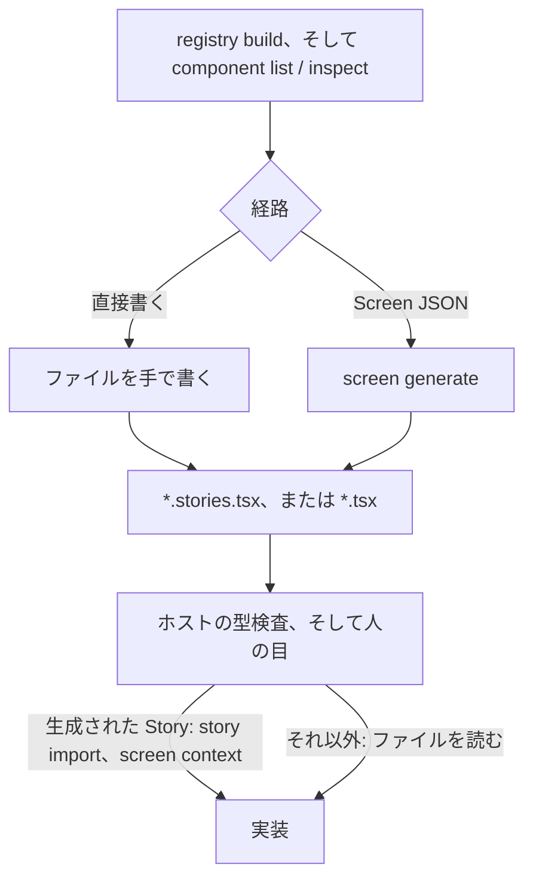
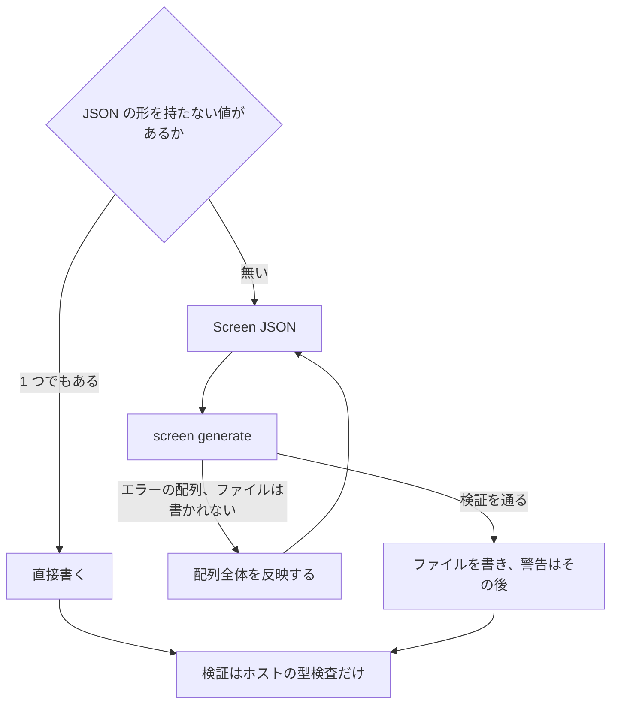
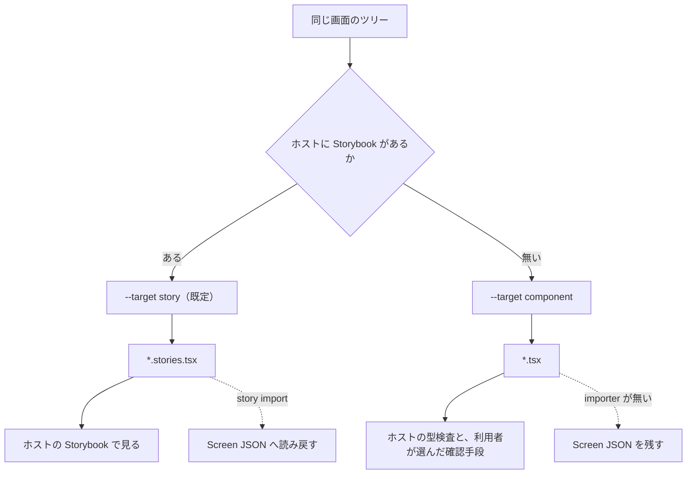
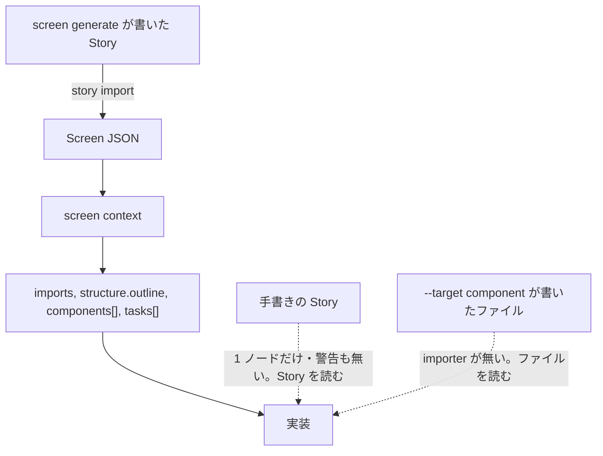

# ワークフロー

[English](../workflows.md) | 日本語

Yosegi は 2 方向に走ります。
上流では登録済みのコンポーネントから Story を組み立て、下流ではその Story を実ページへ転換します。



必須なのは `registry build` と `component list` / `inspect` で、図の「経路」から先はこのページが順に説明する選択になります。

## ユースケース

想定する読み手は、既に Storybook 上のデザインシステムを持つプロダクトチームです。Yosegi を叩くのは人ではなくコーディングエージェントで、人は普段の言葉でエージェントに頼みます。

### ユースケース 1: 画面モックを速く作る

- 人が言うこと: 「うちのコンポーネントでクーポン管理画面のモックを作って」
- エージェントがやること: Registry を作り、使うコンポーネントを inspect し、ホストの規約を読み、Story を書きます。
  直接書くか、静的な画面であれば検証の恩恵を取りに Screen JSON を経由するかを選びます。
- 成果物: ホストの Storybook にそのまま置ける `.stories.tsx`。
  実物のコンポーネントと実物の props で描かれ、ホスト自身の型検査を通っています。

修正も同じ会話で進みます。
「ここを 3 カラムにして」「ここは Card ではなく Table で」。
エージェントは Story か Screen JSON を直して出し直すだけです。

### ユースケース 2: 承認されたモックを実装へ移す

- 人が言うこと: 「このモックを実装して」
- エージェントがやること: Story とホストのページ規約を読み、モックの値を実データへ繋ぎながら実ページを書きます。Yosegi が生成した Story なら、先に実装コンテキストを取って `tasks[]` を 1 つずつ潰せます。
- 成果物: 実ページの実装。
  レビュアーが承認したのと同じコンポーネントで組まれています。

入力は Story ファイルだけなので、モックを組んだのが別の人・別のセッションでもかまいません。
ただし `story import` に手を伸ばす前に「下流」の制約を読んでください。

### ユースケース 3: Figma を介さずイテレーションする

レビューで見るものと実装で使うものが同じコンポーネントになります。

- デザインシステムに無い見た目は、そもそも組めません。Registry に無いコンポーネントは検証で弾かれます。
- 承認された案がそのままユースケース 2 の入力になるので、「実装したら別のコンポーネントだった」というズレが起きません。
- 逆に、既存のコンポーネントでは足りないことが早く分かります。
  実装中の不意打ちではなく、デザインシステムへの要望として出てきます。

新しいビジュアル表現を決めるのは引き続き Figma の仕事です。Yosegi が扱うのは、いま手元にあるコンポーネントで組める画面を見せるところまでです。

## 上流: Story を組み立てる

`registry build` → `component list` / `inspect` → Story。

必須なのは最初の 2 段で、ここで実際の props を確定させ、推測した prop を出荷しないようにします。
画面の骨格や合成の作法は Registry ではなくホスト自身の Story やテンプレートから得ます。Story をどう書くかは形式の選択でしかありません。
画面上のどれか 1 つでも JSON の形を持たない値を必要とするなら（ランタイムのオブジェクト、コンポーネント参照、式で組む `ReactNode`、条件分岐）、Screen JSON には表現する構文が無いので直接書きます。
モックデータ・繰り返し・画面状態は表現できます。`fixtures` が binding の参照する名前付き JSON 値を運び、`repeat` がサブツリーを一覧の行へ展開します。`variants` は画面のほかの状態（ローディング / エラー / 空）を追加の Story export として出力します（[Screen JSON](./screen-json.md) を参照）。
そうでなければ Screen JSON は、JSX を 1 行も書く前の検証と、下流が読み戻す引き継ぎコメントをくれます。

どちらの経路でも結果を確定させるのはホストの型検査です。JSX を実物の型と突き合わせるので、Registry に対する検証より多くを見ます。



`screen generate` は書き出す前に検証します。
エラーがあれば何も書かず、エラーの配列とともに終了コード 1 で終わります。1 件ずつ直すのではなく、配列全体を反映してから再実行します。

```
$ yosegi screen generate tmp/screen.json --out ... --data-dir .yosegi
[
  {
    "nodeId": "card",
    "path": "$.children[0]",
    "code": "INVALID_PROP_VALUE",
    "message": "Value for \"app/components/ui/card#Card.elevation\" does not match kind \"enum\" (received: \"float\").",
    "suggestion": "Use one of: \"flat\", \"raised\""
  },
  {
    "nodeId": "cta",
    "path": "$.children[1]",
    "code": "COMPONENT_NOT_FOUND",
    "message": "Component \"Button\" is not registered.",
    "suggestion": "Did you mean: app/components/ui/button#Button?"
  }
]
```

`COMPONENT_NOT_FOUND`・`UNKNOWN_PROP`・`UNKNOWN_BINDING_TARGET` にはレーベンシュタイン距離で最も近い候補が付きます。`INVALID_PROP_VALUE` には受け取った値と enum の選択肢が付きます。
どのエラーもツリー内の位置を示す `path` を持つので、id が衝突していてもノードを特定できます。variant の木で起きた issue はさらに variant 名を持つ `variant` を運び、その `path` は variant の operations 適用後の木を指します。
警告は生成を止めず、ファイル書き出しの後に並びます。

生成される meta は既定では `title` だけです。
ホストが要求する定型は `--meta-template <file>` で差し込みます。
値はソースの断片として解釈せずに引き継ぐので、Yosegi が持っていない Figma の URL を捏造することはありません。
ただしテンプレート元にした既存 Story の URL はそのまま引き継がれ、警告で名指しされます。

### Storybook が無い場合

Storybook を持たないホストでは、`screen generate --target component` が同じ画面を CSF ではなく素の React コンポーネントファイルとして書き出します。
検証・`fixtures`・`repeat`・`variants` の挙動は同一で、各状態は Story export ではなく export された関数になります。
こうしたファイルをどこでレビューするかを Yosegi は規定しません。
レビューはホストの型検査に加えて、利用者が選んだ確認手段（たとえば作業用のルートにコンポーネントを描画する）で行うものなので、エージェントは推測せずに確認します。
知っておくべき非対称が 1 つあります。`story import` が読めるのは Story だけなので、コンポーネントファイルは Screen JSON へ読み戻せません。
画面をあとで直す可能性があるなら Screen JSON を残しておきます。



どちらのターゲットも同じレンダラと同じ import プランを通るので、JSX は同一になります。

## 検証エラーの code

どのエラーも機械可読な `code` と、直し方を決められるだけの `suggestion` を持ちます。

| code | 意味 | 直し方 |
| --- | --- | --- |
| `COMPONENT_NOT_FOUND` | その id は Registry に無い | `suggestion` の候補に差し替える。候補が無ければ `component list --query` で探し直す |
| `UNKNOWN_PROP` | その prop は無い | `suggestion` の名前に直すか、`component inspect` で実在する props を並べる。ノード直下に置くべきフィールド（`bindings` / `events` / `when` / `each` / `repeat`）を `props` の中に書いた場合もここに落ち、ノードへ移す `suggestion` が付く |
| `UNKNOWN_BINDING_TARGET` | `bindings` のキーが存在しない prop を指している | `suggestion` の名前に直す。`ReactNode` の prop は prop ではなく slot なので binding の宛先にはできない |
| `INVALID_PROP_VALUE` | 値が型や enum と合わない。message に受け取った値が入る | `suggestion` の選択肢から選ぶ |
| `MISSING_REQUIRED_PROP` | 必須 prop に値が無い。message に kind が入る | 値を入れる（enum なら `suggestion` に選択肢が付く）。binding だけで満たせるのは式が識別子パスの場合のみ |
| `FUNCTION_PROP_VALUE` | 関数型の prop に値を書いている | 宣言を `events`（または `bindings`）へ移し、`props` から消す |
| `RESERVED_PROP` | `props` の中に `children`・`key`・`ref` を書いている | これらは JSX の属性として出力されない。内容は `slots.children` へ移し、`key`・`ref` は消す |
| `SLOT_NOT_FOUND` | その slot は無い | `component inspect` で slots を確認する。子要素はたいてい `children` |
| `SLOT_COMPONENT_NOT_ALLOWED` / `SLOT_MAX_ITEMS_EXCEEDED` | slot の制約がその子を許さない | 許されるものは `suggestion` にある |
| `PARENT_NOT_ALLOWED` / `CHILD_NOT_ALLOWED` | 親子の組み合わせに制約がある | 許されるコンポーネントは `suggestion` にある |
| `DUPLICATE_NODE_ID` | 2 つのノードが同じ `id` を持つ。message に衝突した両方の `path` が入る。`repeat` 展開の `-1`〜`-N` サフィックスが既存 id と衝突する場合もここに落ちる | どちらかを変える |
| `REPEAT_ON_ROOT` | ルートノードに `repeat` がある。複製を収める親 slot が無い | コンテナノードで包み、子へ `repeat` を付ける |
| `REPEAT_OUT_OF_RANGE` | `repeat` が 2〜20 の整数でない | 数を直すか、1 つで足りるなら `repeat` を消す |
| `REPEAT_EXPANSION_TOO_LARGE` | すべての `repeat` を展開すると 2000 ノードを超える。ネストした `repeat` は掛け算で増える | 数を下げるか、ネストを解く |
| `VARIANT_OPERATION_FAILED` | variant の `operations` をベースの木へ適用できなかった。message に失敗した operation の code が入る | operation が指すすべての `nodeId` がベースの木に存在する（または同じ variant の先行 operation が追加した）ように直す |

生成を止めない警告:

| code | 意味 |
| --- | --- |
| `REGISTRY_VERSION_MISMATCH` | 画面が参照する Registry version が、使っている Registry と違う |
| `MISSING_REQUIRED_SLOT` | 必須の slot が空。モックでは意図的なことが多い |
| `BOUND_REQUIRED_PROP` | 必須 prop が binding だけで宣言されている。Story には `prop={<式>}` が出るため、その名前が Story に存在するまで型検査を通らない。binding の先頭が fixture 名なら実在するので出ない |
| `UNUSED_FIXTURE` | どの binding も参照しない fixture。出力はされる。たいていは binding のリネームか削除の名残 |
| `NOT_EDITABLE_PROP_VALUE` | not-editable な prop に値を書いている。形が検証されないまま Story へ出る |
| `UNKNOWN_EVENT_TARGET` | `events` のキーが Manifest に無い prop を指している。Manifest がイベントの一覧を持たないため警告どまり |
| `SYNTHETIC_NAME_SHADOWED` | 短い id が合成プリミティブに解決されたが、Registry にも同名のホストコンポーネントがある |
| `DEPRECATED_COMPONENT` | 非推奨のコンポーネント |

`INVALID_REQUEST` はこれらとは別物です。
スキーマを満たしていないファイルでは検証に到達せず、代わりに `{ "error": { "code": "INVALID_REQUEST", "issues": [...], "hints": [...] } }` が返ります。`issues` の `path` が問題箇所を指し、`hints` が正しい形を示します。
まず形を直してから上のループに入ります。

## 下流: Story を実装へ転換する

`story import` → `screen context` → ホストの規約に従って実装。

**この経路が機能するのは `screen generate` が書いた Story に対してだけ**です。`story import` は Story を TypeScript の AST で解析しますが、現実の Story がコンポーネントツリーを直書きすることはまずありません。
通例は `render` が隣のファイルで定義したラッパーコンポーネント 1 つを返す形です。
その Story は 1 ノードに、しかも読めない構文が無い以上は警告 0 件で import されます。
画面が抜け落ちていることを知らせるものは何もありません。
手書きの Story が相手なら、Story そのものを読んでください。

`screen generate` が書いた Story は、ノード id を除いてそのまま読み戻ります。
形が実行時にしか決まらない構文は `warnings` に載り、読めた範囲のツリーは返ります。



`screen context` は Screen JSON を実装コンテキストへ展開します。
実装中に効くのは主に 4 つです。

- `imports`: そのまま貼れる import 文。CSF エミッタと同じ import 計画から出るので、生成された Story と食い違うことがありません。
- `structure.outline`: 入れ子をインデントした行で表したもの。
- `components[]`: 使っているコンポーネントごとの `usedProps` / `usedSlots` / `manifest` / `importStatement`。
  合成プリミティブと未登録の id には印が付きます。
- `tasks[]`: `bindings` と `events` を結線タスクへ平坦化したもの。
  各タスクは `nodeId` と `$.children[1]` 形式の `path` を持ちます。

残り（`requirements` / `target` / `implementation` / `screen`）は補助情報です。

## `story import` の警告

解析はソースの AST だけで行うため、形が実行時にしか決まらない構文は読めません。
ツリーを 1 つも復元できないときは、下記 2 つのコードのいずれかを `error.code` に、警告の全リストを `error.warnings` に入れた標準のエラーエンベロープを返し、exit 1 で終わります。
それ以外では読めないノードに印を付けて先へ進みます。**ノード・prop・intent を名指しする警告は、その内容が Screen JSON に入っていないことを意味します**ので、その部分は元の Story を直接読みます。`TITLE_NOT_STATIC`、`MULTIPLE_ROOTS`、`MULTIPLE_STORIES` のような情報通知は内容を保ったまま、何が変わったかだけを伝えます。`warnings` が空であること自体は何の証明にもなりません。Story と突き合わせてノード数を数えてください。

| code | 意味 |
| --- | --- |
| `STORY_NOT_FOUND` | `render` 関数を持つ export が無い（`component` + `args` 形式の Story がここに落ちる）か、`--story-name` がどの export とも一致しない（メッセージに候補が並ぶ）。exit 1 で何も取り込まれない |
| `RENDER_NOT_STATIC` | 選ばれた export の `render` が静的に読めない。`--story-name` が `args` のみの export を指したときもここ。exit 1 で何も取り込まれない |
| `TITLE_NOT_STATIC` | meta の `title` が静的な文字列でない。画面名がフォールバックするだけで取り込みは続く |
| `OPAQUE_EXPRESSION` | `{items.map(...)}` や条件分岐など、静的に読めない式。そのノードは落ちる |
| `OPAQUE_PROP` | prop の値が読めない（変数参照など）。その prop だけが落ちる |
| `OPAQUE_ELEMENT` | 対応する合成プリミティブが無い DOM タグ。`Box` として残るがタグ名は失われる |
| `SPREAD_ATTRIBUTE` | `{...args}` は展開できない |
| `INTENT_NOT_APPLIED` | intent コメントの直後に兄弟要素が複数あり、`bindings`・`events` を付ける先を決められず落ちた |
| `OPAQUE_FIXTURE` | トップレベルの const の初期化子が JSON リテラルでなく、fixture として読み戻せなかった |
| `COMPONENT_NOT_RESOLVED` | import 文から Registry の id へ辿れない。ノードはローカル名のまま残るので、検証が候補を出す |
| `COMPONENT_AMBIGUOUS` | 同じ export 名の候補が複数ある。`--import-map` で絞る |
| `IMPORT_PATH_MISMATCH` | export 名は一致するが import 元が Registry と違う。Registry が古い可能性 |
| `MULTIPLE_ROOTS` | ルート要素が複数あったため `Box` で包んだ |
| `MULTIPLE_STORIES` | 取り込んだものより多くの Story をファイルが export している（典型は `variants` のファイル）。1 回の実行で読むのは 1 export。別の export は `--story-name` で読む。差分が `variants` へ再構成されることはない |

## 次に読む

- [CLI リファレンス](./cli.md) — 上で使った全コマンドとフラグ。
- [Screen JSON](./screen-json.md) — これらのワークフローが読み書きする形。
